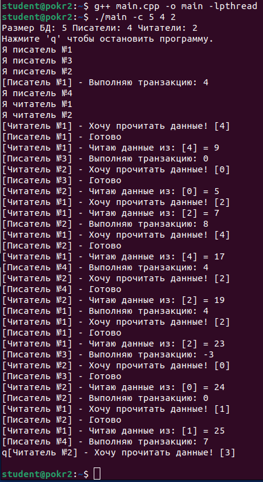
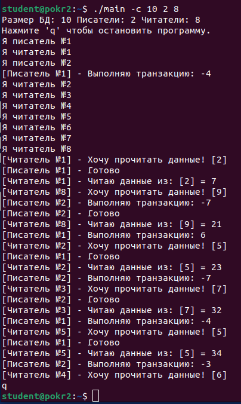
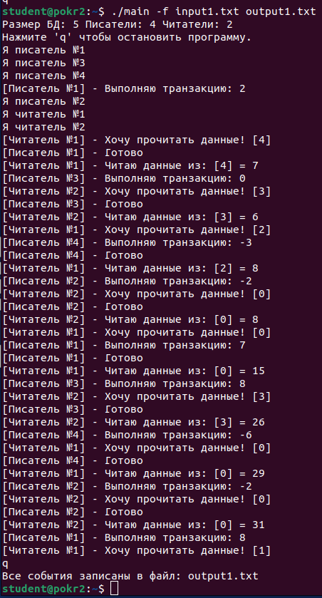
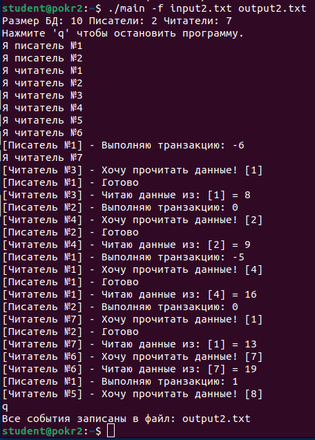
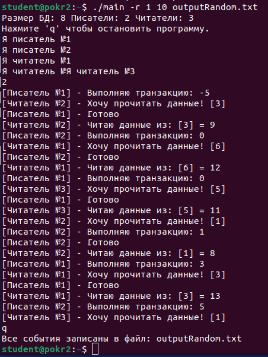

# HW_4

## Шаповалов Артём Сергеевич | БПИ-217 | Вариант 4

### Задание 4. Построение многопоточных приложений | Вариант 4

#### Задача о читателях и писателях.

Базу данных разделяют два типа процессов – читатели и писатели. Читатели выполняют транзакции, которые просматривают записи базы данных, транзакции писателей и просматривают и изменяют записи. Предполагается, что в начале БД находится в непротиворечивом состоянии (например, если каждый элемент — число, то они все отсортированы). Каждая отдельная транзакция переводит БД из одного непротиворечивого состояния в другое. Для предотвращения взаимного влияния транзакций процесс-писатель должен иметь исключительный доступ к БД. Если к БД не обращается ни один из процессов-писателей, то выполнять транзакции могут одновременно сколько угодно читателей. Создать многопоточное приложение с потоками-писателями и потоками-читателями. Реализовать решение, используя семафоры.
* * *
### Решение на 8 баллов :

Для реализации задачи была выбрана модель "Производители и потребители".

Производители и потребители – это парадигма взаимодействующих неравноправных потоков. Одни потоки «производят» данные, другие их «потребляют». 
В данной задаче производителями являются писатели, а потребителями - читатели.

По этой [ссылке](https://www.geeksforgeeks.org/producer-consumer-problem-using-semaphores-set-1/) используемая модель описана более подробно.

Код с подробными комментариями, объясняющими алгоритм работы - [main.cpp](main.cpp)

* * *
#### Ключи:

- **-с <размер БД> <кол-во писателей> <кол-во читателей>** (ввод через командную строку)
- **-f <входной файл> <выходной файл>** (ввод из входного файла и запись результата в выходной файл)
- **-r <нижнаяя граница> <верхняя граница> <опционально выходной файл>** (рандомный ввод)
* * *
#### Ввод через терминал

Результат теста консольного ввода:
  

Результат дополнительного теста консольного ввода:
  
* * *
#### Файловый ввод

В программу добавлены ввод данных из файла и вывод результатов в файл:
- [input1.txt](input1.txt) - Входные данные
- [output1.txt](output1.txt) - Выходные данные

Работа программы с входным файлом [input1.txt](input1.txt)
  

Дополнительное тестирование на других данных:
- [input2.txt](input2.txt) - Входные данные
- [output2.txt](output2.txt) - Выходные данные

Работа программы с входным файлом [input2.txt](input1.txt)
  
* * *
#### Рандомный ввод

Результат теста рандомного ввода:
  

Полученный файл - [outputRandom.txt](outputRandom.txt)

